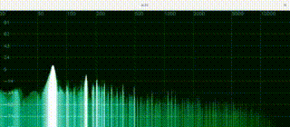

# a2i: Audio to Image Spectrogram Utility



## Table of Contents

- [Overview](#overview)
- [Features](#features)
- [Requirements](#requirements)
- [Installation](#installation)
  - [Linux](#linux)
  - [Windows](#windows)
  - [macOS](#macos)
- [Usage](#usage)
  - [Command Line Options](#command-line-options)
  - [Controls](#controls)
  - [Examples](#examples)
- [Configuration](#configuration)
- [API Reference](#api-reference)
  - [Initialization](#initialization)
  - [Customizing Parameters](#customizing-parameters)
  - [Generating Spectrograms](#generating-spectrograms)
- [FAQ](#faq)
- [Troubleshooting](#troubleshooting)
  - [Common Issues](#common-issues)
  - [Reporting Issues](#reporting-issues)
- [Changelog](#changelog)
- [Future Plans](#future-plans)
- [Contributing](#contributing)
- [License](#license)

## Overview

`a2i` is a powerful utility and library for generating and visualizing audio spectrograms. It leverages the capabilities of `raylib` for audio processing and `OpenCV` for image manipulation and visualization, along with the `a2i` library for spectrogram generation.

## Features

- Convert audio files to spectrogram images.
- Real-time spectrogram visualization from microphone input.
- Customizable spectrogram parameters (window function, amplitude range, etc.).
- Various visualization options (colormap, grid, line types, etc.).
- Control playback with keyboard inputs.

## Requirements

Ensure your system is up to date and has the necessary dependencies:
```sh
sudo apt update && sudo DEBIAN_FRONTEND=noninteractive apt install -y make build-essential pkg-config git libfftw3-dev libopencv-dev pulseaudio pulseaudio-utils python3-pip libx11-dev libxrandr-dev libxinerama-dev libxcursor-dev libxi-dev libgl1-mesa-dev cmake
```


## Installation

### Linux

1. **Clone the repository:**
```sh
git clone https://github.com/d33fur/a2i.git && cd a2i
```

2. **Build and install:**
```sh
make
```

3. **Run the executable:**
```sh
a2i <audio-file> [options]
```

### Windows

To be added.

### macOS

To be added.

## Usage

### Command Line Options

```sh
Usage:
  a2i <path> [options]
Options:
  -a <range>              Amplitude range (default: -90,50)
  -w <int>                Window function (0-9, default: 9)
  -l <int>                Line type (0-2, default: 0)
  -g <int>                Graph mode (0-1, default: 1)
  -m <int>                Normalize multiplier (default: 20)
  -mic                    Use microphone
  -f <int>                Frame size (>=512, default: 65536)
  -n <int>                Number of previous frames (>0)
  -size <height,width>    Window size (default: 400,2100)
  -grad <int>             Colormap (0-21)
  -fill <int>             Fill type (0-2, default: 2)
  -border                 Border line
  -line <color>           Line color (default: 255,255,255)
  -underline <color>      Underline color (default: 127,127,127)
  -grid                   Grid
  -grad_coef <int>        Gradient coefficient (0-255, default: 127)
  -grid_line_color <color> Grid line color
  -grid_text_color <color> Grid text color
  -h, -help               Show this help message
```

### Controls

- `Space`: Pause/Resume
- `Left Arrow`: Rewind 5 seconds
- `Right Arrow`: Fast Forward 5 seconds
- `Esc`: Exit

## Examples

### Visualize a real-time spectrogram from an audio file
To visualize a spectrogram with specific settings, use the following command:
```sh
a2i myaudiofile.wav -a=-90,100 -n=20 -size=400,1000 -grad=17 -grad_coef=255 -grid
```

### Real-time microphone input visualization
For real-time spectrogram visualization using your microphone:
```sh
a2i -mic -a=-90,100 -n=20 -size=400,1000 -grad=17 -grad_coef=255 -grid
```

### Changing the window function and amplitude range
```sh
a2i myaudiofile.wav -w=7 -a=-80,70 -size=500,1200 -grad=10 -grid
```

## Configuration

You can configure various parameters in `config.ini` to customize the behavior of `a2i`. Here's an example configuration:

```ini
[General]
AmplitudeRange=-90,50
WindowFunction=9
LineType=0
GraphMode=1
NormalizeMultiplier=20
FrameSize=65536
NumberOfPreviousFrames=10
WindowSize=400,2100
Colormap=17
FillType=2
BorderLine=1
LineColor=255,255,255
UnderlineColor=127,127,127
Grid=1
GradientCoefficient=127
GridLineColor=128,128,128
GridTextColor=200,200,200
```


## API Reference

### Initialization

```
<code>
```

### Customizing Parameters

```cpp
#include "raylib.h"
#include <opencv2/opencv.hpp>
#include <opencv2/highgui.hpp>
#include <a2i/spectrogram.hpp>

int main(int argc, char** argv) 
{
    InitAudioDevice();
    Music music = LoadMusicStream("myaudiofile.wav");
    PlayMusicStream(music);
    SetMusicVolume(music, 0.8f);
    AttachAudioStreamProcessor(music.stream, callback);

    g.setAudioInfo(music.stream.sampleRate, {-90, 50});
    g.setFreqRange({20, 20000});
    g.setFrameSize(FRAME_SIZE);
    g.setWindowFunc(9);

    cv::namedWindow("a2i", cv::WINDOW_NORMAL);
    cv::resizeWindow("a2i", WINDOW_WIDTH, WINDOW_HEIGHT);

    cv::Mat img(WINDOW_HEIGHT, WINDOW_WIDTH, CV_8UC3, cv::Scalar(22, 16, 20));

    while (true)
    {
        UpdateMusicStream(music);

        if (show)
        {
            img = cv::Mat(WINDOW_HEIGHT, WINDOW_WIDTH, CV_8UC3, cv::Scalar(22, 16, 20));
            g.drawSpectrum(img, 0, 1, 2, true, {255, 255, 255}, {127, 127, 127}, 127);
            cv::imshow("a2i", img);
        }

        if (cv::waitKey(1) == 27) break; // Exit on ESC key
    }

    UnloadMusicStream(music);
    CloseAudioDevice();
    cv::destroyAllWindows();

    return 0;
}
```

### Generating Spectrograms

```cpp
#include "raylib.h"
#include <opencv2/opencv.hpp>
#include <a2i/spectrogram.hpp>

int WINDOW_WIDTH = 800;
int WINDOW_HEIGHT = 600;
unsigned int FRAME_SIZE = 65536;
a2i::Spectrogram g;
int multiplier = 20;
bool show = false;

typedef struct 
{
    float left;
    float right;
} Frame;

void callback(void *bufferData, unsigned int frames) 
{
    if (frames < 512) return;

    Frame *fs = static_cast<Frame*>(bufferData);

    if (g.in.size() == FRAME_SIZE)
    {
        g.in.erase(g.in.begin(), g.in.begin() + frames);
    }

    for (size_t i = 0; i < frames; ++i) 
    {
        g.in.push_back((fs[i].left + fs[i].right) / 2);
    }

    if (g.in.size() == FRAME_SIZE)
    {
        g.addWindow();
        g.fft();
        g.normalize(multiplier);
        show = true;
    }
    else
    {
        show = false;
    }
}
```

## FAQ

### How do I install additional dependencies?

Follow the instructions in the [Requirements](#requirements) section to ensure all dependencies are installed.

### Can I use `a2i` on Windows or macOS?

Support for Windows and macOS is planned. For now, `a2i` is primarily tested on Linux.

## Troubleshooting

### Common Issues
(добавить про пульсаудио)
- **Audio file not found**: Ensure the path to the audio file is correct.
- **Dependency issues**: Make sure all dependencies are installed as specified in the [Requirements](#requirements) section.

### Reporting Issues

If you encounter any issues, please open an issue on the [GitHub repository](https://github.com/d33fur/a2i/issues).

## Changelog

(написать что типа смотрите CHANGELOG.md)


## Future Plans

- Support for more platforms (Windows, macOS)
- Enhanced visualization options
- Integration with more audio formats

## Contributing

Contributions are welcome! Please fork the repository and submit a pull request with your changes. For major changes, please open an issue first to discuss what you would like to change.

## License

This project is licensed under the MIT License. See the [LICENSE](LICENSE) file for details.
